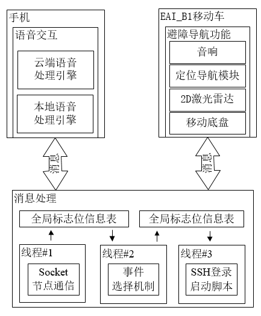
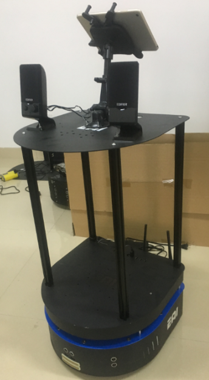

# Name

    robotAI

# Author information:

    Author:Jason Lou
    Email:vip.iotworld@gmail.com
    Website:www.iotworld.vip
    Blog:https://blog.csdn.net/qq_21508727

# Environment:

    OS:ubuntu16.04
    Project IDE:Pycharm
    Project Interpreter:python3.6
    
    
# Evolution:

## V1.*
    version：main_V1.*.py
        Functional_description:
            1. Set A,B,C and D four target points indoors.
            2. Four target points are set and started automatically on the rviz interface by 
               simulating the mouse and keyboard.
        Dependent_file:
            ./core/AutoGUI/*
            ./core/Socket/*
            ./core/SSH/*

--- 
    
## V2.*            
    version：main_V2.*.py
        Functional_description:
            1. Set four A,B,C and D target points indoors.
            2. And after reaching each target point, the system program calls the script to play 
               a voice through the SSH connection to the lower computer, and then proceeds to the 
               next target point.
            3. Automatically complete the setting and startup of four target points by calling 
               the API via HTTP.
            4. And after reaching each target point, the system program calls the script to play 
               a voice through the SSH connection to the lower computer, and then proceeds to the 
               next target point.
        Dependent_file:
            ./core/Audio/*
            ./core/Socket/*
            ./core/SSH/*
            ./core/HTTP/*
            ./core/baidu_API/*
### 程序框架图和硬件实物图     
 
    

---

## V3.*              
    version：main_V3.*.py
        Dependent_file:
            ./core/Audio/*
            ./core/SSH/*
            ./core/HTTP/*
            ./core/Face/*  
